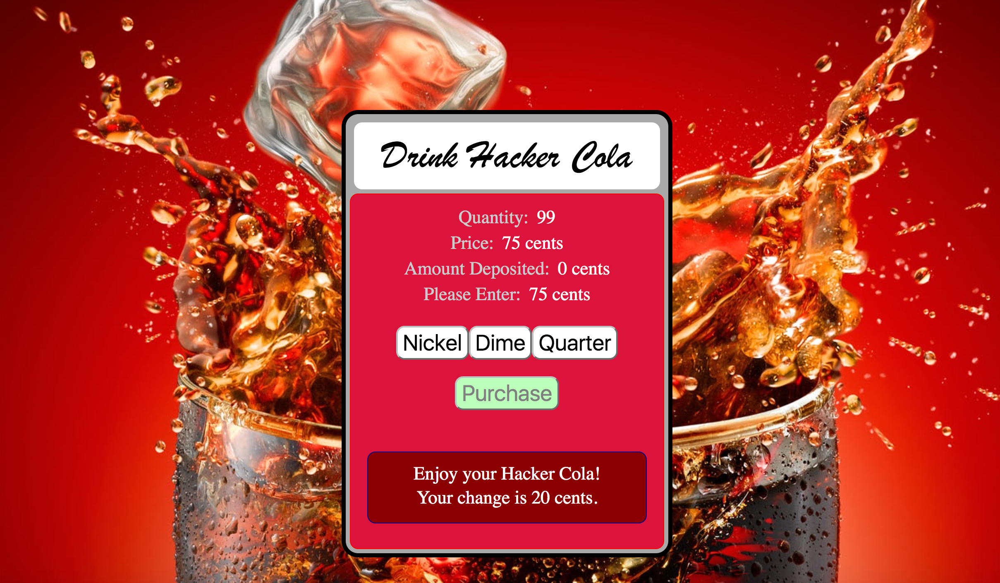

# README

This is a simple Express / NodeJS app to demonstrate routing. We used the express generator to create the project and we are using Pug (aka Jade) to do the server-side rendering.

Each button click hits an Express route that updates the state of the Vending Machine and returns an updated (dynamically rendered) HTML document.

## Screenshot

